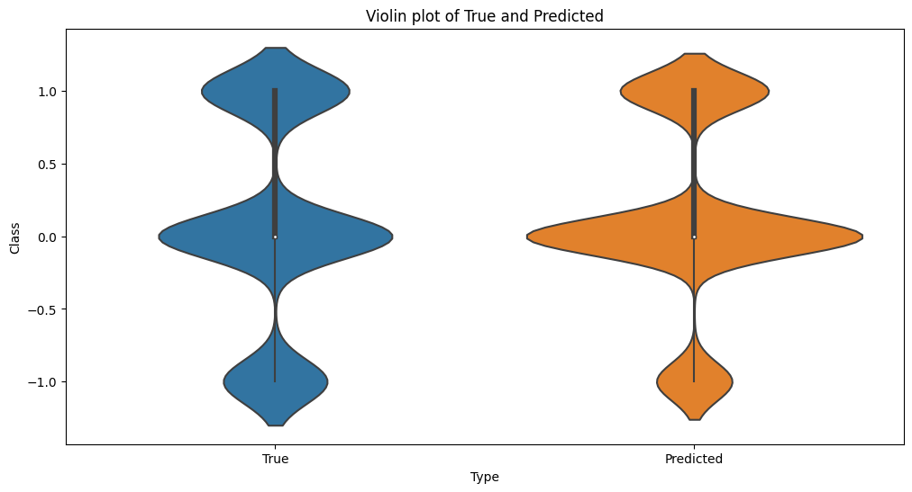
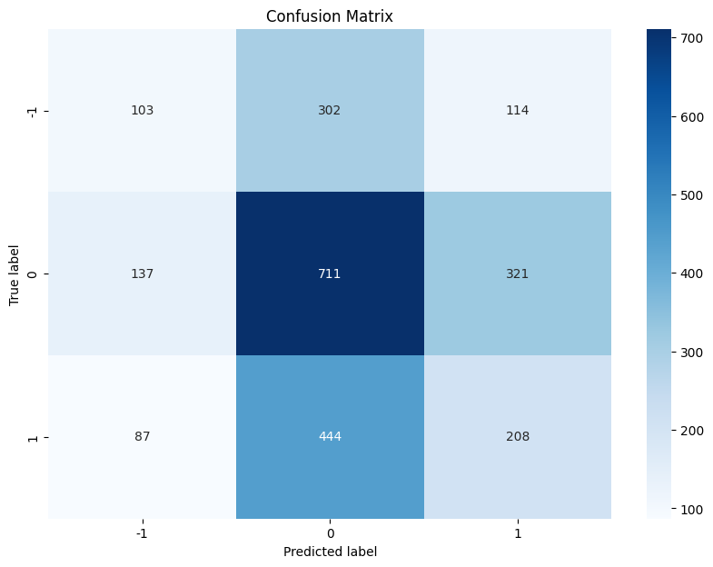
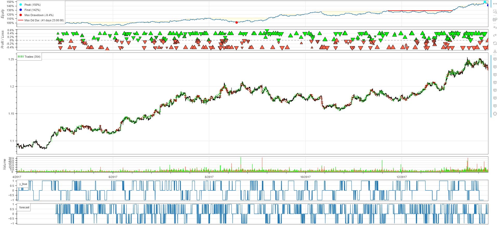

# Background
Imports 5000 rows of sample EURUSD Forex data to use for analysis. Creates TA and price features to analyze. Integrates model with backtesting.py library.

# Model
Uses kNN machine learning model to determine directional accuracy (treated as binary classification problem).

Inspiration from: https://kernc.github.io/backtesting.py/doc/examples/Trading%20with%20Machine%20Learning.html
